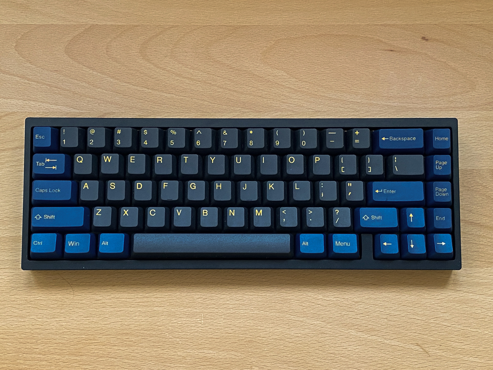
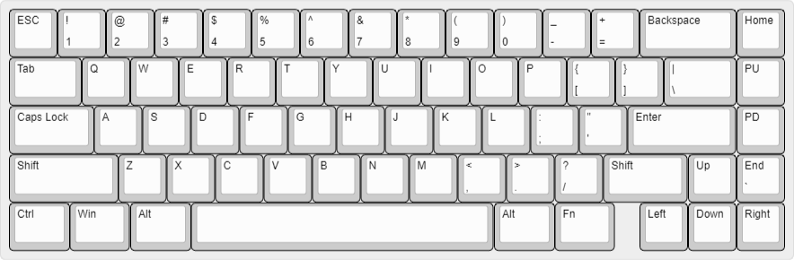

# Mikeneko 65 V4

A simple 65% keyboard for DIYers. This project was derived from [kkatano's Bakeneko 65](https://github.com/kkatano/bakeneko-65).

## Updates

### Differences between Mikeneko 65 V3 and V4

- Switched pcb style from soldering to hotswap

### Differences between Bakeneko 65 V3 and Mikeneko 65 V3

- Added support for PCB screw ins stabilizer
- Switched MCU to ATmega32U4-MU(R) to cope with MCU supply shortage

## Features

- Single piece tray case
- O-ring gasket mount (Friction fit)
- [Unified Daughterboard](https://github.com/ai03-2725/Unified-Daughterboard) or [Simplified Daughterboard](https://github.com/kb-elmo/simplified-daughterboard)
- QMK firmware and VIA (For now, you can use Bakeneko 65's firmware as is)
- PCB designed with KiCAD 5.1.4

## Layouts

## Specs

- Dimensions: 315 x 110 x 30mm
- Front height: 18.5mm
- Home row height: 31mm(with GMK keycaps and bumpons)
- Typing angle: 6 degree
- Weight:
  - PLA Case: 390g
  - Aluminum Case: 760g
- O-ring gasket: VMQ-50(Silicone 50 duro) AS568-264

## Notes

- All files are to be used at your own risk
- As for stabilizers, both PCB snap ins and screw ins are supported

## Resources

- Documents: https://drive.google.com/drive/folders/1tddSihOS8Pgf1lTQOjHohYCl8efxXIeH
  - For now, you can refer Bakeneko 65's documents as is
  - Parts guide and other useful information
- Discord: https://discord.com/channels/927936241805189171/
  - Have fun with community members
  - Talk about Mikeneko builds and mods, and share your works
  - You can also contact me from there

## Special thanks to

- **kkatano** Open-sourced Bakeneko 65 and answered my questions in his community
- People who supported the development of Bakeneko series

## Also I should mention
- Many keyboard community members for giving me advice and feedback, thanks!
